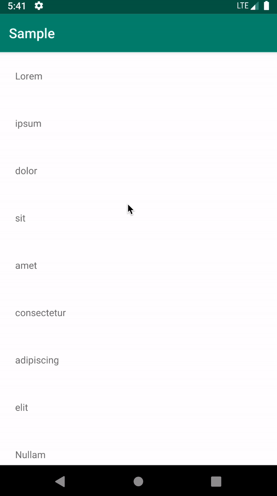
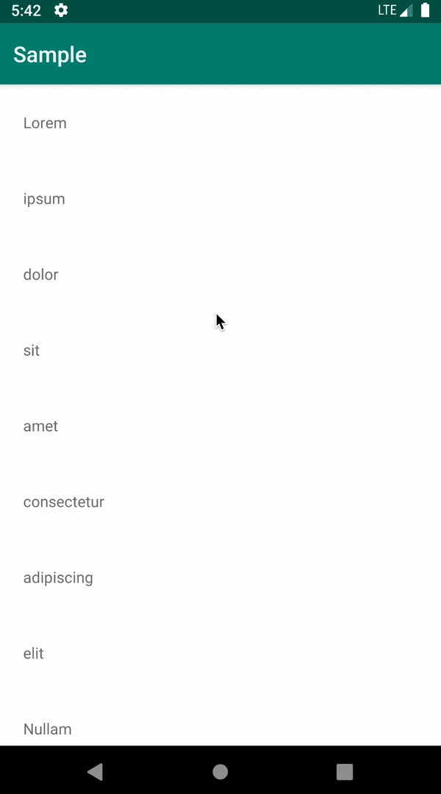
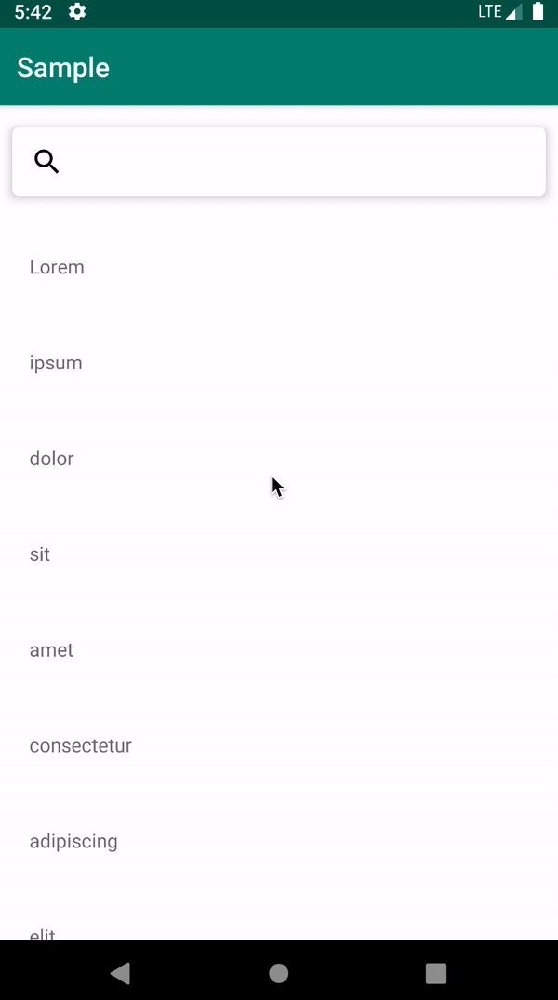

[](https://travis-ci.org/lnicolet/HiddenSearchWithRecyclerView) [](https://opensource.org/licenses/MIT) [  ](https://bintray.com/lnicolet/HiddenSearchWithRecyclerView/HiddenSearchWithRecyclerView/_latestVersion)

# Scroll Down To Search Recycler View


An easy way to search in your recycler view without having an always-on display search view.



How does it work?

Ever wanted a recycler view with a search bar? That's a simple library that lets you wrap your recyclerView into my custom layout which provides a _hidden_ searchview which you can show by scrolling up/down the recycler.

### Include

To include this library in your Android project you have to use `gradle`.

``` gradle
compile 'com.nicolettilu:hiddensearchwithrecyclerview:0.0.1'
```

### Setup
Here's how it works:

```xml
<com.nicolettilu.hiddensearchwithrecyclerview.HiddenSearchWithRecyclerView
    android:layout_width="match_parent"
    android:layout_height="match_parent">
    <android.support.v7.widget.RecyclerView
        android:layout_width="match_parent"
        android:layout_height="match_parent" />
</com.nicolettilu.hiddensearchwithrecyclerview.HiddenSearchWithRecyclerView>
```

You need to wrap your `RecyclerView` with the custom layout the library provides.
At the moment the library provides this configurations:

```xml
<attr name="filterWhileTyping" format="boolean"/> <!-- default value: true -->
<attr name="scrollToTopBeforeShow" format="boolean" /> <!-- default value: false -->
<attr name="scrollToBottomBeforeHide" format="boolean" /> <!-- default value: false -->
<attr name="visibleAtInit" format="boolean" /> <!-- default value: false -->
<attr name="hideAtScroll" format="boolean" /> <!-- default value: true -->
```

You can customize thos attributes in the XML file:
```xml
<com.nicolettilu.hiddensearchwithrecyclerview.HiddenSearchWithRecyclerView
        android:id="@+id/hidden_search_with_recycler"
        android:layout_width="match_parent"
        android:layout_height="match_parent"
        app:scrollToBottomBeforeHide="true"
        app:scrollToTopBeforeShow="true"
        app:filterWhileTyping="false"
        app:visibleAtInit="true">
        <!-- your RecyclerView here -->
</com.nicolettilu.hiddensearchwithrecyclerview.HiddenSearchWithRecyclerView>
```

And in code as well:
```kotlin
val hiddenSearchWithInRecycler = findViewById(R.id.hidden_search_with_recycler) as HiddenSearchWithRecyclerView

hiddenSearchWithInRecycler.hideAtScroll = true
hiddenSearchWithInRecycler.visibleAtInit = false
hiddenSearchWithInRecycler.scrollToBottomBeforeHide = false
hiddenSearchWithInRecycler.scrollToTopBeforeShow = false
hiddenSearchWithInRecycler.filterWhileTyping = true
```


Here as some example of the results:


- Default example (no configurations set) 


- Scroll at top/bottom before hide/show `SearchView` example 


- `SearchView` shown at init example 


&nbsp;
&nbsp;

The MIT License (MIT)
=====================

Copyright © `<year>` `<copyright holders>`

Permission is hereby granted, free of charge, to any person
obtaining a copy of this software and associated documentation
files (the “Software”), to deal in the Software without
restriction, including without limitation the rights to use,
copy, modify, merge, publish, distribute, sublicense, and/or sell
copies of the Software, and to permit persons to whom the
Software is furnished to do so, subject to the following
conditions:

The above copyright notice and this permission notice shall be
included in all copies or substantial portions of the Software.

THE SOFTWARE IS PROVIDED “AS IS”, WITHOUT WARRANTY OF ANY KIND,
EXPRESS OR IMPLIED, INCLUDING BUT NOT LIMITED TO THE WARRANTIES
OF MERCHANTABILITY, FITNESS FOR A PARTICULAR PURPOSE AND
NONINFRINGEMENT. IN NO EVENT SHALL THE AUTHORS OR COPYRIGHT
HOLDERS BE LIABLE FOR ANY CLAIM, DAMAGES OR OTHER LIABILITY,
WHETHER IN AN ACTION OF CONTRACT, TORT OR OTHERWISE, ARISING
FROM, OUT OF OR IN CONNECTION WITH THE SOFTWARE OR THE USE OR
OTHER DEALINGS IN THE SOFTWARE.
