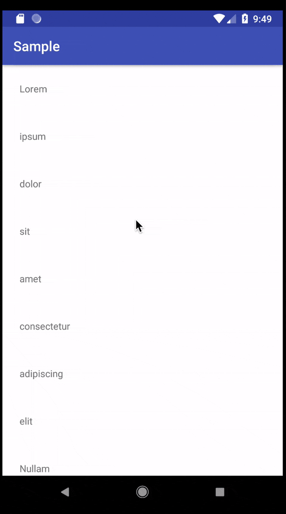

# Scroll Down To Search Recycler View
An easy way to search in your recycler view without having an always-on display search view.

How does it work?

Ever wanted a recycler view with a search bar? That's a simple library that lets you wrap your recyclerView into my custom layout which provides a _hidden_ searchview which you can show by scrolling up/down the recycler.